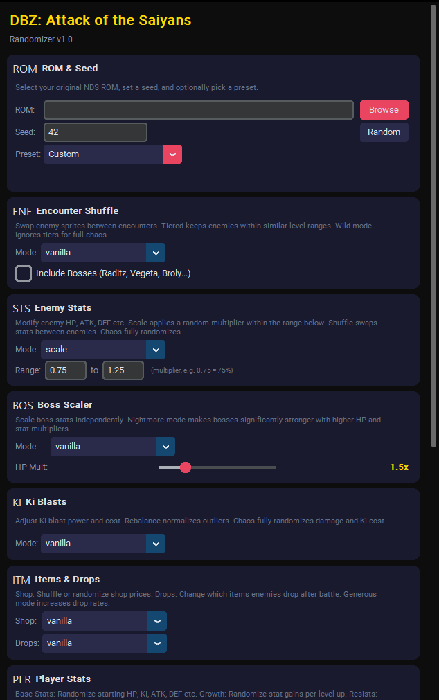

# DBZ: Attack of the Saiyans Randomizer by Momentum DevTools


### Info
This project was created to fully randomize the Nintendo DS classic *Dragon Ball Z: Attack of the Saiyans* (2009). Built by reverse-engineering the ARM9 binary and extracting the proprietary `.narc` file system, this tool allows for complete procedural manipulation of encounters, stats, items, and boss logic.

Have a look at the [Release page](https://github.com/momentumdevtools/dbz-aots-randomizer/releases) for changelogs and downloads. 

*Legal Disclaimer: This tool does not provide any copyrighted material. You must supply your own legally dumped `.nds` ROM of the game to use this software.*

---

## Download & Usage

1. Download the latest release `.zip` from [Releases](https://github.com/momentumdevtools/dbz-aots-randomizer/releases)
2. Extract the zip (keep the folder structure intact!)
3. Run `DBZ_AotS_Randomizer_v5.exe`
4. Select your ROM, configure settings, click **Randomize!**

> **Important:** The `.exe` must stay in the same folder as `_internal/`. Do not move it out of the extracted directory.

## Running from Source (Alternative)

If you prefer running directly from Python (no .exe needed):

```bash
# Requirements: Python 3.10+
pip install customtkinter ndspy

# Run the GUI
python randomizer/gui.py
```

## Features

| Module | Modes | Description |
|--------|-------|-------------|
| **Encounter Shuffle** | Tiered / Wild | Swap enemy sprites between encounters |
| **Force Enemy** | Any enemy | Replace ALL enemies with one (debug/fun) |
| **Enemy Stats** | Shuffle / Scale / Chaos | Randomize enemy HP, ATK, DEF, etc. |
| **Boss Scaler** | Scale | Multiply boss HP and stats |
| **Skills** | Shuffle / Chaos | Randomize skill power, cost, and unlocks |
| **Drop Shuffle** | Shuffle / Chaos | Randomize enemy item drops |
| **Shop Items** | Shuffle / Chaos | Randomize shop inventory and prices |
| **XP Rewards** | Multiplier | Scale XP, Zeni, and AP rewards |
| **Resistances** | Chaos | Randomize enemy elemental/status resistances |
| **Music Shuffle** | Shuffle / Chaos | Shuffle background music tracks |
| **Palette** | Shift / Random / Chaos | Recolor enemy sprites |
| **Presets** | 5 built-in | Quick configurations for common playstyles |

---

## Antivirus Notice

⚠️ **Some antivirus software may flag the `.exe` as suspicious.** This is a known false positive caused by [PyInstaller](https://pyinstaller.org), the tool used to bundle the Python application.

**Why this happens:**
- PyInstaller packages Python + all dependencies into a distributable folder
- The bundled DLLs and the bootloader pattern trigger heuristic (AI-based) AV detection
- Standard Windows initialization (DPI setup, font loading, file dialog paths) generates registry activity that sandboxes report as suspicious
- Windows SmartScreen checks unknown `.exe` files against Microsoft's reputation servers — this may show as a network connection (often routed through UK datacenters)

**None of this is malicious.** The entire source code is open and auditable in this repository. The randomizer only reads your `.nds` ROM, modifies game data (BDAT tables, CHR sprites) in memory, and writes a new `.nds` file. It makes **zero** intentional registry writes and **zero** network connections.

**If you want 100% peace of mind**, run directly from source using the instructions above.

---

## Contributing
If you want to contribute something to the codebase (e.g., expanding Archipelago logic or new hex-mapping), we'd recommend creating an issue for it first. This way, we can discuss whether or not it's a good fit for the randomizer before you put in the work to implement it. This is just to save you time in the event that we don't think it's something we want to accept.

### What is a good fit for the randomizer?
In general, we try to make settings as universal as possible. This means that it preferably should work without consistently breaking the game's core progression (preventing softlocks), and also that it's something many people will find useful. If the setting is very niche, it will mostly just bloat the GUI. 

If your idea is a change to an existing setting rather than a new setting, it needs to be well motivated.

### Feature requests
We do not take feature requests. *(Note: Patrons have voting rights on major architectural milestones, but individual feature requests on GitHub will be closed).*

### Bug reports
If you encounter something that seems to be a bug (e.g., a specific seed causing a crash or softlock), submit an issue using the Issue tracker. Please always include your Seed, your exact GUI settings, and the emulator you are using.

### Other problems
If you have problems using the randomizer, it could be because of a bad ROM dump, a strict Antivirus blocking the `.exe`, or your operating system. Ensure your base ROM is a clean, unmodified dump of the game before creating an issue.

---

## Support the Development
If you want to support our reverse-engineering efforts, read our technical Ghidra dev-logs, or get early access to beta builds, check out our [Patreon](https://www.patreon.com/momentumdevtools/).

## Building from Source

```bash
pip install pyinstaller customtkinter ndspy

python -m PyInstaller --onedir --windowed \
  --name DBZ_AotS_Randomizer_v5 \
  --add-data="path/to/customtkinter;customtkinter" \
  --collect-all=ndspy \
  randomizer/gui.py
```

## License

This project is for educational and personal use. Dragon Ball Z: Attack of the Saiyans is © Bandai Namco / Monolith Soft.
